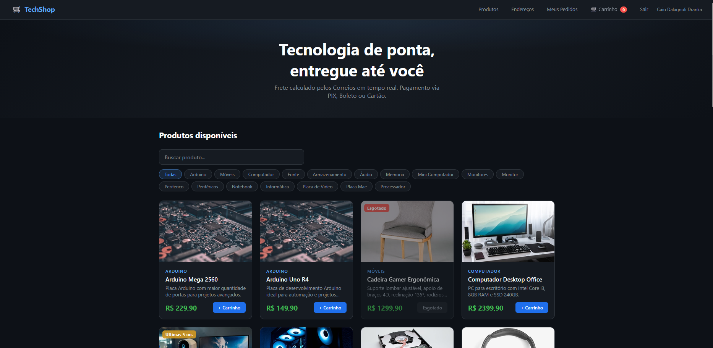
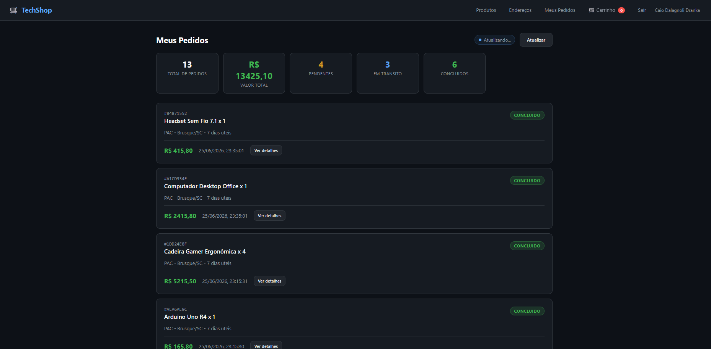
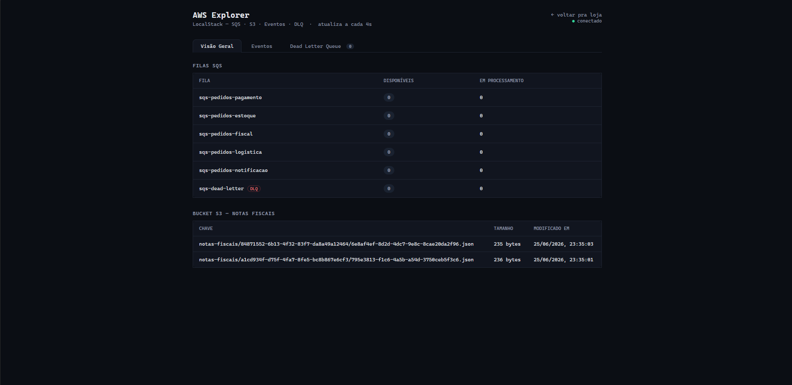
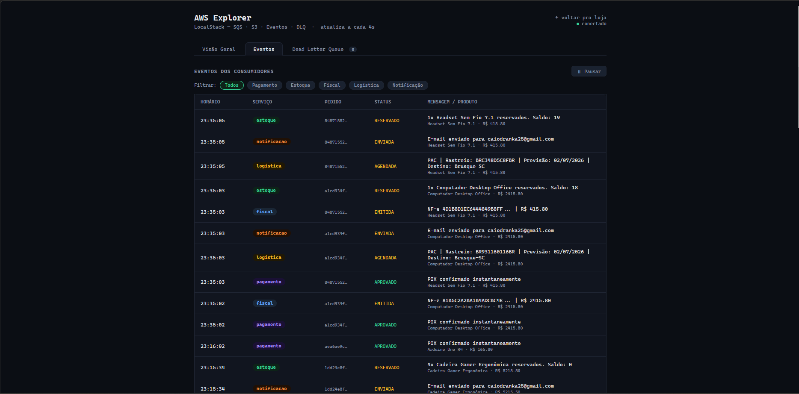

# E-commerce Distribuído com Supabase, SQS e LocalStack

Sistema de **e-commerce** desenvolvido para fins acadêmicos, simulando uma loja virtual completa: cadastro/login de usuários, catálogo de produtos, cálculo de frete, finalização de pedidos e processamento assíncrono em segundo plano (pagamento, baixa de estoque, emissão fiscal, logística e notificação ao cliente).

A arquitetura reproduz, em pequena escala, um sistema real de e-commerce distribuído: a API recebe o pedido e o publica em **filas de mensagens (SQS)**, enquanto **5 serviços consumidores independentes** processam cada etapa do pedido em paralelo, sem travar a resposta ao usuário.

**Disciplina:** Sistemas Distribuídos — FURB, 2026/1





---

## Sumário

- [Sobre o projeto](#sobre-o-projeto)
- [Arquitetura e stack](#arquitetura-e-stack)
- [Estrutura do projeto](#estrutura-do-projeto)
- [Pré-requisitos](#pré-requisitos--o-que-baixar-e-instalar)
- [Passo 1 — Criar o ambiente Python com Anaconda](#passo-1--criar-o-ambiente-python-com-anaconda)
- [Passo 2 — Criar conta e projeto no Supabase](#passo-2--criar-conta-e-projeto-no-supabase)
- [Passo 3 — Criar as tabelas no Supabase (SQL)](#passo-3--criar-as-tabelas-no-supabase-sql)
- [Passo 4 — Configurar o arquivo .env](#passo-4--configurar-o-arquivo-env)
- [Passo 5 — Subir o Docker (LocalStack)](#passo-5--subir-o-docker-localstack)
- [Passo 6 — Provisionar a infraestrutura com Terraform](#passo-6--provisionar-a-infraestrutura-com-terraform)
- [Passo 7 — Iniciar a API, o frontend e os consumidores](#passo-7--iniciar-a-api-o-frontend-e-os-consumidores)
- [Passo 8 — Testar o sistema](#passo-8--testar-o-sistema)
- [AWS Explorer](#aws-explorer)
- [Endpoints da API](#endpoints-da-api)
- [Fluxo do sistema](#fluxo-do-sistema)
- [Como parar tudo](#como-parar-tudo)
- [Solução de problemas comuns](#solução-de-problemas-comuns)
- [Checklist para utilização](#checklist-para-utilização)
- [Requisitos do trabalho atendidos](#requisitos-do-trabalho-atendidos)

---

## Sobre o projeto

O objetivo é simular, de ponta a ponta, o fluxo de compra de um e-commerce real:

1. O cliente cria conta e faz login (autenticação JWT via **Supabase Auth**).
2. Navega pelo catálogo de produtos (armazenado no **Supabase/PostgreSQL**).
3. Cadastra um endereço de entrega — o CEP é validado/preenchido automaticamente via **API ViaCEP**.
4. O sistema calcula o frete (**PAC** e **SEDEX**) consultando a **API dos Correios**.
5. Ao finalizar a compra, a API salva o pedido no banco e o publica em **5 filas SQS** (rodando localmente via **LocalStack**, que emula a nuvem AWS).
6. **5 serviços consumidores** (processos Python independentes) escutam essas filas e processam o pedido em paralelo:
   - **Pagamento** — valida e aprova/recusa o pagamento;
   - **Estoque** — dá baixa na quantidade do produto;
   - **Fiscal** — gera a nota fiscal e salva um arquivo no **S3** (LocalStack);
   - **Logística** — define transportadora e agenda a entrega;
   - **Notificação** — notifica o cliente e conclui o pedido.
7. Cada etapa registra um evento na tabela `eventos_pedido`, permitindo acompanhar em tempo real, pelo frontend, todo o processamento do pedido (como uma linha do tempo).

Esse desenho demonstra, na prática, conceitos de **sistemas distribuídos**: comunicação assíncrona via mensageria, desacoplamento de serviços, infraestrutura como código (Terraform) e uso de nuvem (real + emulada).

---

## Arquitetura e stack

| Camada | Tecnologia |
|---|---|
| Autenticação + Banco de dados | **Supabase** (Auth + PostgreSQL gerenciado, em nuvem real) |
| API REST | **FastAPI** (Python) |
| Mensageria assíncrona | **Amazon SQS** via **LocalStack** (emulação local da AWS) |
| Armazenamento de arquivos | **Amazon S3** via LocalStack (notas fiscais) |
| Cálculo de frete | **API dos Correios** (PAC + SEDEX) |
| Validação de CEP | **API ViaCEP** |
| Infraestrutura como código | **Terraform** |
| Frontend | HTML + CSS + JavaScript puro |
| Ambiente Python | **Anaconda** |

---

## Estrutura do projeto

```
ecommerce_AWS_LocalStack/
├── api/
│   ├── main.py              # FastAPI — todos os endpoints
│   ├── auth.py              # Validação do JWT do Supabase
│   ├── models.py            # Schemas de validação (Pydantic)
│   ├── viacep.py            # Consulta ViaCEP (valida/completa CEP)
│   └── correios.py          # Cálculo de frete PAC + SEDEX
├── config/
│   ├── settings.py          # Leitura das variáveis de ambiente (.env)
│   ├── supabase_client.py   # Cliente Supabase (anon + admin)
│   └── sqs.py               # Cliente SQS, publicação e consumo de filas
├── consumidores/            # Os 5 serviços assíncronos
│   ├── _base.py             # registrar_evento() — grava histórico no Supabase
│   ├── pagamento.py
│   ├── estoque.py
│   ├── fiscal.py            # Gera NF-e e salva no S3 (LocalStack)
│   ├── logistica.py
│   └── notificacao.py
├── infra/
│   └── main.tf              # Terraform: cria as filas SQS no LocalStack
├── app/                     # Frontend (HTML, CSS e JS separados)
│   ├── index.html           # Loja — marcação HTML
│   ├── admin.html           # AWS Explorer — marcação HTML
│   ├── css/
│   │   ├── loja.css         # Estilos da loja
│   │   └── admin.css        # Estilos do AWS Explorer
│   └── js/
│       ├── loja/            # Lógica da loja: config, auth, produtos,
│       │                    # carrinho, endereços, pedidos, main
│       └── admin/           # Lógica do AWS Explorer: filas, S3, eventos, DLQ, simulador
├── docs/
│   ├── Comandos AWS CLI/
│   │   └── README.md        # Comandos úteis do AWS CLI para o LocalStack
│   ├── Comandos SQL/
│   │   ├── supabase_schema.sql          # Script SQL para criar as tabelas
│   │   └── supabase_insert_product.sql  # Inserts extras de produtos (opcional)
│   └── Definição/           # Diagramas e documento de definição do trabalho
├── scripts/
│   ├── start_all.bat        # Inicia tudo no Windows (Anaconda base)
│   └── start_all.sh         # Inicia tudo no Linux/Mac
├── logs/                    # Logs gerados pelos serviços (criada automaticamente)
├── launcher_server.py       # Inicia TUDO automaticamente (recomendado)
├── check_env.py             # Utilitário de debug do token JWT (opcional)
├── docker-compose.yml       # Sobe o LocalStack (SQS + S3)
├── requirements.txt
└── .env_example             # Modelo do arquivo de variáveis de ambiente
```

---

## Pré-requisitos — o que baixar e instalar

Instale as ferramentas abaixo **antes de começar**:

| Ferramenta | Link de download | Para que serve |
|---|---|---|
| **Anaconda** (Python) | https://www.anaconda.com/download | Ambiente e dependências Python do projeto |
| **Docker Desktop** | https://www.docker.com/products/docker-desktop/ | Roda o LocalStack (SQS + S3) em container |
| **Terraform CLI** | https://developer.hashicorp.com/terraform/install | Provisiona as filas SQS via código |
| **AWS CLI** *(opcional)* | https://aws.amazon.com/cli/ | Inspecionar filas/bucket no LocalStack pelo terminal |
| **Conta no Supabase** | https://supabase.com | Banco de dados + autenticação em nuvem (gratuito) |

> **Sobre o Terraform:** crie uma pasta `Terraform` no disco, cole o executável dentro e adicione o caminho ao PATH nas variáveis de sistema. Se ocorrer erro por conflito de versão, execute:
> ```bash
> cd infra
> del .terraform.lock.hcl        # Windows
> rd /s /q .terraform             # Windows
> terraform init -upgrade
> terraform apply -auto-approve
> ```

> **Sobre o AWS CLI:** não é obrigatório para o projeto funcionar. Serve apenas para inspecionar filas e o bucket manualmente. Após instalar, configure com:
> ```bash
> aws configure
> ```
> Preencha com os seguintes valores (credenciais falsas aceitas pelo LocalStack):
> ```
> AWS Access Key ID:     test
> AWS Secret Access Key: test
> Default region name:   us-east-1
> Default output format: json
> ```

Após instalar tudo, abra o **Anaconda Prompt** e confira as versões:

```bash
conda --version
python --version
docker --version
docker-compose --version
terraform --version
aws --version          # apenas se você instalou o AWS CLI
```

---

## Passo 1 — Criar o ambiente Python com Anaconda

Abra o **Anaconda Prompt** (Windows) ou o terminal (Mac/Linux) na pasta do projeto.

### 1.1 Criar um ambiente conda dedicado (recomendado)

```bash
conda create -n ecommerce-sd python=3.11 -y
conda activate ecommerce-sd
```

> Mantenha esse ambiente **ativado** (`conda activate ecommerce-sd`) em **todo terminal novo** que você abrir para rodar qualquer parte do projeto.

### 1.2 Instalar as dependências

```bash
pip install -r requirements.txt
```

Isso instala: FastAPI, Uvicorn, Supabase SDK, httpx, Pydantic, python-dotenv, python-jose, passlib, boto3 e python-multipart.

> **Sobre o `scripts\start_all.bat`:** localiza automaticamente o Python do ambiente **base** do Anaconda. Se você criou um ambiente próprio (`ecommerce-sd`), use o `launcher_server.py` ou o modo manual.

---

## Passo 2 — Criar conta e projeto no Supabase

### 2.1 Criar o projeto

1. Acesse **https://supabase.com** e clique em **Start your project**.
2. Crie uma conta com Google, GitHub ou e-mail (gratuito).
3. Clique em **New Project** e preencha:
   - **Name:** `ecommerce-sd`
   - **Database Password:** anote esta senha.
   - **Region:** `South America (São Paulo)`
4. Clique em **Create new project** e aguarde cerca de 2 minutos.

### 2.2 Coletar as chaves da API

No painel do projeto: menu lateral → **Settings** → **API**.

| Variável | Onde encontrar no painel |
|---|---|
| `SUPABASE_URL` | Seção **Project URL** → campo `URL` |
| `SUPABASE_ANON_KEY` | Seção **Project API Keys** → `anon public` |
| `SUPABASE_SERVICE_ROLE_KEY` | Seção **Project API Keys** → `service_role` → clique em **Reveal** |
| `JWT_SECRET` | Seção **JWT Settings** → `JWT Secret` → clique em **Reveal** |

> Copie esses 4 valores agora — você vai colá-los no arquivo `.env` no Passo 4.

### 2.3 Desativar confirmação de e-mail (somente para testes/apresentação)

1. Menu lateral → **Authentication** → **Providers** → **Email**.
2. Desative a opção **Confirm email**.
3. Clique em **Save**.

---

## Passo 3 — Criar as tabelas no Supabase (SQL)

1. No painel do Supabase, abra **SQL Editor** (menu lateral).
2. Clique em **New Query**.
3. Abra o arquivo `docs/Comandos SQL/supabase_schema.sql`, copie todo o conteúdo e cole no editor.
4. Clique em **Run** (ou `Ctrl+Enter`).
5. Deve aparecer: `Success. No rows returned`.

### Tabelas criadas

| Tabela | O que armazena |
|---|---|
| `produtos` | Catálogo de produtos (já vem com itens inseridos pelo script) |
| `enderecos` | Endereços de entrega cadastrados por cada usuário |
| `pedidos` | Cada compra realizada, com status do processamento |
| `eventos_pedido` | Linha do tempo de eventos gerados pelos 5 consumidores |

Confirme em **Table Editor** que as 4 tabelas existem e que `produtos` tem linhas. Se quiser produtos extras, rode também `docs/Comandos SQL/supabase_insert_product.sql`.

---

## Passo 4 — Configurar o arquivo `.env`

### 4.1 Criar o arquivo a partir do modelo

```bash
# Windows (cmd / Anaconda Prompt)
copy .env_example .env

# Mac/Linux
cp .env_example .env
```

### 4.2 Preencher com os valores do Supabase

Abra o `.env` em um editor de texto e preencha:

```env
# ── Supabase (cole os valores coletados no Passo 2.2) ──────
SUPABASE_URL=https://xxxxxxxxxxxxxxxxxxxx.supabase.co
SUPABASE_ANON_KEY=eyJhbGciOiJIUzI1NiIsInR5cCI6IkpXVCJ9...
SUPABASE_SERVICE_ROLE_KEY=eyJhbGciOiJIUzI1NiIsInR5cCI6IkpXVCJ9...
JWT_SECRET=sua-jwt-secret-aqui
PROJECT_PASSWORD=senha-do-banco-no-supabase   # apenas anotação

# ── LocalStack / AWS (não precisa alterar) ─────────
AWS_ENDPOINT_URL=http://localhost:4566
AWS_REGION=us-east-1
AWS_ACCESS_KEY_ID=test
AWS_SECRET_ACCESS_KEY=test
S3_BUCKET_NOTAS=ecommerce-notas-fiscais
MAX_RETRIES=3
```

> O arquivo `.env` contém segredos e já está no `.gitignore` — nunca o suba para um repositório público.

---

## Passo 5 — Subir o Docker (LocalStack)

O `docker-compose.yml` sobe apenas o LocalStack, que emula as filas SQS e o bucket S3 localmente.

### 5.1 Abrir o Docker Desktop

Garanta que o ícone da baleia esteja ativo na barra de tarefas antes de continuar.

### 5.2 Subir o container

```bash
docker-compose up -d
```

> Aguarde ~15 segundos para o LocalStack inicializar.

### 5.3 Verificar se está rodando

```bash
docker ps
curl http://localhost:4566/_localstack/health
```

Resposta esperada:
```json
{"services": {"sqs": "available", "s3": "available"}, ...}
```

### 5.4 (Opcional) Configurar o AWS CLI

```bash
aws configure
# AWS Access Key ID:     test
# AWS Secret Access Key: test
# Default region name:   us-east-1
# Default output format: json
```

---

## Passo 6 — Provisionar a infraestrutura com Terraform

> **Atenção:** se você usar o `launcher_server.py` (Passo 7 — Opção A), este passo é feito **automaticamente**. Só execute manualmente se for usar outra forma de inicialização.

O Terraform cria as filas SQS e a DLQ dentro do LocalStack:

- `sqs-pedidos-pagamento`
- `sqs-pedidos-estoque`
- `sqs-pedidos-fiscal`
- `sqs-pedidos-logistica`
- `sqs-pedidos-notificacao`
- `sqs-dead-letter` (DLQ — recebe mensagens que falharam 3 vezes)

```bash
cd infra
terraform init        # apenas na primeira vez
terraform apply -auto-approve
cd ..
```

### Criar o bucket S3 para as notas fiscais

> O `launcher_server.py` também cria o bucket automaticamente. Se precisar criar manualmente:

```bash
# Com AWS CLI
aws --endpoint-url=http://localhost:4566 s3 mb s3://ecommerce-notas-fiscais

# Sem AWS CLI (só Python)
python -c "import boto3; boto3.client('s3', endpoint_url='http://localhost:4566', region_name='us-east-1', aws_access_key_id='test', aws_secret_access_key='test').create_bucket(Bucket='ecommerce-notas-fiscais')"
```

> **Importante:** o LocalStack perde todos os dados (filas + bucket) ao ser reiniciado. O `launcher_server.py` recria tudo automaticamente a cada inicialização.

---

## Passo 7 — Iniciar a API, o frontend e os consumidores

### ✅ Opção A — `launcher_server.py` (recomendado)

```bash
python launcher_server.py
```

Esse script faz tudo automaticamente:
1. Aguarda o LocalStack e roda `terraform init` + `terraform apply`;
2. Cria o bucket S3;
3. Sobe a API FastAPI (porta 8000);
4. Sobe os 5 consumidores em segundo plano (logs em `logs/`);
5. Sobe o frontend (porta 3000) e abre o navegador.

Para encerrar, pressione `CTRL+C` — todos os processos em background são encerrados automaticamente.

### Opção B — Scripts `start_all`

```bash
# Windows (Anaconda Prompt, ambiente "base")
scripts\start_all.bat

# Mac/Linux
bash scripts/start_all.sh
```

### Opção C — Manual (um terminal por processo)

| Terminal | Comando | O que faz |
|---|---|---|
| 1 | `uvicorn api.main:app --reload --port 8000` | API FastAPI |
| 2 | `python launcher_server.py` | Frontend, porta 3000 |
| 3 | `python consumidores/pagamento.py` | Consumidor de pagamento |
| 4 | `python consumidores/estoque.py` | Consumidor de estoque |
| 5 | `python consumidores/fiscal.py` | Consumidor fiscal + S3 |
| 6 | `python consumidores/logistica.py` | Consumidor de logística |
| 7 | `python consumidores/notificacao.py` | Consumidor de notificação |

### Verificar a API no ar

```bash
curl http://localhost:8000/
# Resposta esperada: {"status": "ok", "versao": "2.0.0", ...}
```

Swagger (documentação interativa): **http://localhost:8000/docs**

---

## Passo 8 — Testar o sistema

### Via frontend (recomendado)

Acesse **http://localhost:3000** e siga o fluxo:

1. Clique em **Entrar** → **Criar conta** → preencha nome, e-mail e senha.
2. Faça login com as credenciais criadas.
3. Na tela de **Produtos**, clique em um produto para ver os detalhes.
4. Adicione ao carrinho.
5. Vá até o **Carrinho**.
6. Cadastre um **Endereço** (o CEP é preenchido automaticamente via ViaCEP).
7. Selecione o endereço — o frete PAC e SEDEX é calculado automaticamente.
8. Escolha a forma de pagamento e clique em **Finalizar Pedido**.
9. Em **Meus Pedidos**, clique em **Ver detalhes** para acompanhar em tempo real o processamento pelos 5 serviços.

### Via curl (linha de comando)

```bash
# 1. Cadastrar usuário
curl -X POST http://localhost:8000/auth/register \
  -H "Content-Type: application/json" \
  -d "{\"email\":\"teste@email.com\",\"senha\":\"Senha123!\",\"nome\":\"João Silva\"}"

# 2. Login (guarde o access_token retornado)
curl -X POST http://localhost:8000/auth/login \
  -H "Content-Type: application/json" \
  -d "{\"email\":\"teste@email.com\",\"senha\":\"Senha123!\"}"

# 3. Ver produtos
curl http://localhost:8000/produtos

# 4. Calcular frete
curl "http://localhost:8000/frete?cep=89010000"

# 5. Cadastrar endereço
curl -X POST http://localhost:8000/enderecos \
  -H "Authorization: Bearer TOKEN" \
  -H "Content-Type: application/json" \
  -d "{\"apelido\":\"Casa\",\"cep\":\"89010000\",\"logradouro\":\"Rua Sete de Setembro\",\"numero\":\"100\",\"bairro\":\"Centro\",\"cidade\":\"Blumenau\",\"uf\":\"SC\",\"principal\":true}"

# 6. Criar pedido
curl -X POST http://localhost:8000/pedidos \
  -H "Authorization: Bearer TOKEN" \
  -H "Content-Type: application/json" \
  -d "{\"produto_id\":\"PRODUTO_ID\",\"quantidade\":1,\"endereco_id\":\"ENDERECO_ID\",\"forma_pagamento\":\"pix\"}"

# 7. Ver status do pedido
curl http://localhost:8000/pedidos/PEDIDO_ID \
  -H "Authorization: Bearer TOKEN"
```

> No Windows (cmd), use as barras invertidas para escape (`\"`). No PowerShell, prefira aspas simples envolvendo o JSON.

---

## AWS Explorer

O AWS Explorer é uma interface de administração disponível em **http://localhost:3000/admin.html**. Ele atualiza automaticamente a cada 4 segundos e possui três abas:

### 📊 Visão Geral
Mostra o estado atual das 6 filas SQS (mensagens disponíveis e em processamento) e os arquivos de notas fiscais no bucket S3.

### 📨 Eventos
Exibe em tempo real todos os eventos registrados pelos 5 consumidores ao processar pedidos. Possui filtro por serviço (pagamento, estoque, fiscal, logística, notificação) e botão de pausa.

### 💀 Dead Letter Queue
Mostra as mensagens que falharam 3 vezes e foram movidas para a fila `sqs-dead-letter`, com número de tentativas, horário e conteúdo de cada mensagem.

Inclui também um **painel de simulação de DLQ**, que permite enviar mensagens inválidas para qualquer fila para demonstrar o mecanismo de retry e DLQ:

1. Escolha a **fila de destino**
2. Selecione um **preset** (JSON inválido, corpo vazio, campo faltando, etc.) ou escreva sua própria mensagem
3. Clique em **⚡ Enviar para a fila**
4. Acompanhe a linha do tempo: o consumidor tentará processar 3 vezes, falhará e a mensagem aparecerá na DLQ em ~90 segundos

---

## Endpoints da API

| Método | Rota | Autenticação | Descrição |
|---|---|---|---|
| `POST` | `/auth/register` | Não | Cadastro de usuário |
| `POST` | `/auth/login` | Não | Login (retorna JWT) |
| `POST` | `/auth/logout` | Sim | Logout |
| `POST` | `/auth/refresh` | Não | Renova o token de acesso |
| `GET` | `/produtos` | Não | Lista os produtos disponíveis |
| `GET` | `/produtos/{id}` | Não | Detalha um produto |
| `GET` | `/enderecos` | Sim | Lista endereços do usuário logado |
| `POST` | `/enderecos` | Sim | Cadastra um endereço |
| `DELETE` | `/enderecos/{id}` | Sim | Remove um endereço |
| `GET` | `/frete?cep=XXXXXXXX` | Não | Calcula frete PAC e SEDEX |
| `POST` | `/pedidos` | Sim | Cria um pedido (publica nas filas SQS) |
| `GET` | `/pedidos` | Sim | Lista pedidos do usuário logado |
| `GET` | `/pedidos/{id}` | Sim | Detalha o pedido e os eventos de processamento |
| `GET` | `/admin/eventos` | Não | Lista eventos recentes (uso interno — AWS Explorer) |
| `GET` | `/` | Não | Health check da API |

Documentação interativa completa em **http://localhost:8000/docs**.

---

## Fluxo do sistema

```
Usuário (login via Supabase Auth)
    │
    ▼
POST /pedidos  (JWT no header Authorization)
    │
    ├─► Supabase: busca produto e valida estoque
    ├─► Supabase: busca endereço do usuário
    ├─► Correios: calcula frete PAC e SEDEX
    ├─► Supabase: salva pedido (status = PENDENTE)
    └─► SQS (LocalStack): publica em 5 filas simultaneamente
              │
    ┌─────────┴──────────────────────────────────┐
    ▼         ▼         ▼          ▼              ▼
Pagamento  Estoque    Fiscal    Logística     Notificação
    │         │         │          │              │
    │      desconta   gera NF-e  agenda        marca pedido
 aprova/   estoque     e salva   entrega        como
 recusa   (Supabase)   no S3   (Supabase)      CONCLUIDO
                                                (Supabase)
    │
    └──── todos os serviços registram eventos em eventos_pedido (Supabase)

Falha em qualquer consumidor (3x):
    └─► mensagem vai para sqs-dead-letter (DLQ) automaticamente
```

---

## Como parar tudo

```bash
# Encerrar via launcher_server.py: pressione CTRL+C no terminal
# Todos os processos em background são encerrados automaticamente.

# Se precisar forçar no Windows:
taskkill /F /IM python.exe

# Mac/Linux:
pkill -f "uvicorn api.main:app"
pkill -f "launcher_server.py"
pkill -f "consumidores/"

# Derrubar o LocalStack
docker-compose down

# Sair do ambiente conda
conda deactivate
```

> Lembre-se: ao subir o LocalStack novamente, o `launcher_server.py` recria filas e bucket automaticamente.

---

## Solução de problemas comuns

**`401 Unauthorized` em rotas protegidas**
O `JWT_SECRET` no `.env` está errado. Copie exatamente de **Settings → API → JWT Settings → JWT Secret** no painel do Supabase.

**Filas SQS não encontradas / erro ao publicar nas filas**
O LocalStack foi reiniciado. Execute `python launcher_server.py` — ele recria as filas automaticamente. Ou manualmente: `cd infra && terraform apply -auto-approve`.

**`docker-compose: command not found` ou erro de conexão com o Docker**
Abra o Docker Desktop e aguarde ele inicializar completamente.

**`pip install` falha ou pacotes não encontrados**
Confirme que o ambiente conda está ativado: `conda activate ecommerce-sd`.

**`terraform: command not found`**
O Terraform não está no PATH. Adicione o caminho da pasta `Terraform/` às variáveis de ambiente do sistema e reinicie o terminal.

**Conflito de versão do Terraform**
```bash
cd infra
del .terraform.lock.hcl
rd /s /q .terraform
terraform init -upgrade
terraform apply -auto-approve
```

**Bucket S3 não existe (erro NoSuchBucket no AWS Explorer)**
O `launcher_server.py` cria o bucket automaticamente. Se inicializou manualmente, crie com:
```bash
python -c "import boto3; boto3.client('s3', endpoint_url='http://localhost:4566', region_name='us-east-1', aws_access_key_id='test', aws_secret_access_key='test').create_bucket(Bucket='ecommerce-notas-fiscais')"
```

**Logs cheios de erros `NonExistentQueue`**
Os consumidores foram iniciados antes das filas existirem. Limpe os logs antigos (`rmdir /s /q logs`) e reinicie com `python launcher_server.py`, que garante a ordem correta.

**Frete retorna valores simulados**
A API dos Correios pode estar fora do ar. O sistema tem fallback automático — o fluxo de compra não é afetado.

**Porta 3000 ou 8000 já em uso**
Feche processos anteriores ou, no Windows, finalize via Gerenciador de Tarefas os processos `python.exe`/`uvicorn.exe` pendentes.

---

## Checklist para utilização

- [ ] Anaconda instalado e ambiente conda ativado (`conda activate ecommerce-sd`)
- [ ] `pip install -r requirements.txt` concluído sem erros
- [ ] Docker Desktop aberto e rodando
- [ ] `docker-compose up -d` executado
- [ ] Projeto Supabase criado e SQL (`docs/Comandos SQL/supabase_schema.sql`) executado
- [ ] `.env` preenchido com as chaves do Supabase (a partir do `.env_example`)
- [ ] `python launcher_server.py` executado (cria filas, bucket, API, consumidores e frontend automaticamente)
- [ ] API respondendo em http://localhost:8000
- [ ] Frontend abrindo em http://localhost:3000
- [ ] AWS Explorer abrindo em http://localhost:3000/admin.html
- [ ] 5 consumidores rodando (verificar logs em `logs/`)
- [ ] Cadastro e login de usuário funcionando
- [ ] Endereço cadastrado com busca de CEP automática
- [ ] Cálculo de frete retornando PAC e SEDEX
- [ ] Pedido criado e processado pelos 5 consumidores
- [ ] Eventos aparecendo em "Meus Pedidos" e na aba Eventos do AWS Explorer
- [ ] Simulação de DLQ funcionando na aba Dead Letter Queue

---

## Requisitos do trabalho atendidos

| Requisito | Tecnologia utilizada |
|---|---|
| Banco de dados (não SQLite) | Supabase — PostgreSQL gerenciado em nuvem |
| Mensageria assíncrona | Amazon SQS via LocalStack |
| API externa | ViaCEP (validação de CEP) + API dos Correios (frete) |
| Mínimo de 2 serviços independentes | FastAPI + 5 consumidores Python independentes |
| Uso de nuvem | Supabase (nuvem real) + LocalStack + Terraform (IaC) |
| Dead Letter Queue | Fila `sqs-dead-letter` com retry automático (3 tentativas) e simulador integrado |
